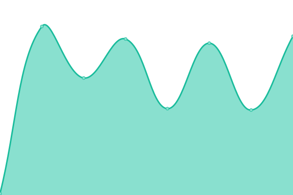
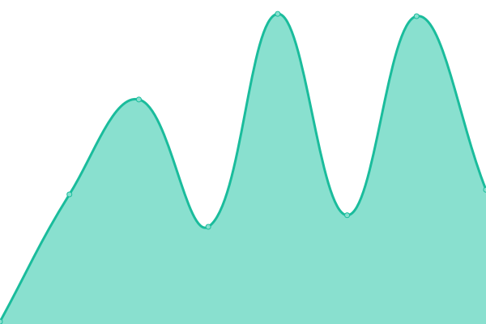

# [📈 Live Status](https://uptime.lepallec.tv): <!--live status--> **🟥 Complete outage**

This repository contains the open-source uptime monitor and status page for [lepallec.tv](https://lepallec.tv), powered by [Upptime](https://github.com/upptime/upptime).

With [Upptime](https://upptime.js.org), you can get your own unlimited and free uptime monitor and status page, powered entirely by a GitHub repository. We use [Issues](https://github.com/elepallece/upptime/issues) as incident reports, [Actions](https://github.com/elepallece/upptime/actions) as uptime monitors, and [Pages](https://uptime.lepallec.tv) for the status page.

<!--start: status pages-->
<!-- This summary is generated by Upptime (https://github.com/upptime/upptime) -->
<!-- Do not edit this manually, your changes will be overwritten -->
<!-- prettier-ignore -->
| URL | Status | History | Response Time | Uptime |
| --- | ------ | ------- | ------------- | ------ |
|  [Plex](https://plex.lepallec.tv/web/index.html) | 🟥 Down | [plex.yml](https://github.com/elepallec/upptime/commits/HEAD/history/plex.yml) | 

 48ms
     
 | 

<a href="https://uptime.lepallec.tv/history/plex">100.00%</a>
    

|  [Ombi](https://ombi.lepallec.tv) | 🟥 Down | [ombi.yml](https://github.com/elepallec/upptime/commits/HEAD/history/ombi.yml) | 

 49ms
     
 | 

<a href="https://uptime.lepallec.tv/history/ombi">100.00%</a>
    

|  [Tautulli](https://tautulli.lepallec.tv) | 🟥 Down | [tautulli.yml](https://github.com/elepallec/upptime/commits/HEAD/history/tautulli.yml) | 

 50ms
     
 | 

<a href="https://uptime.lepallec.tv/history/tautulli">100.00%</a>
    

<!--end: status pages-->

[**Visit our status website →**](https://uptime.lepallec.tv)

## 📄 License

- Powered by: [Upptime](https://github.com/upptime/upptime)
- Code: [MIT](./LICENSE) © [elepallece](https://uptime.lepallec.tv)
- Data in the `./history` directory: [Open Database License](https://opendatacommons.org/licenses/odbl/1-0/)
